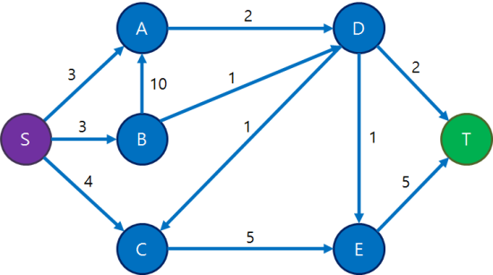
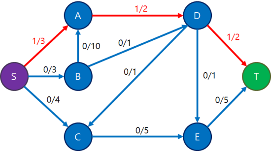
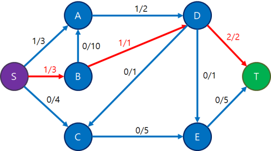
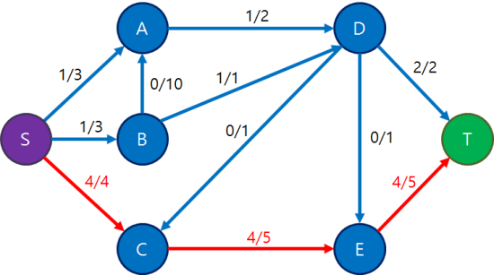
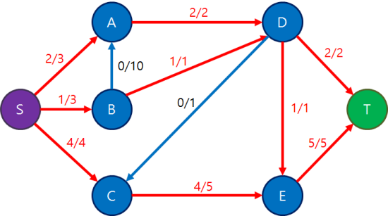
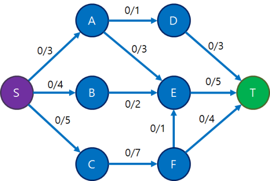
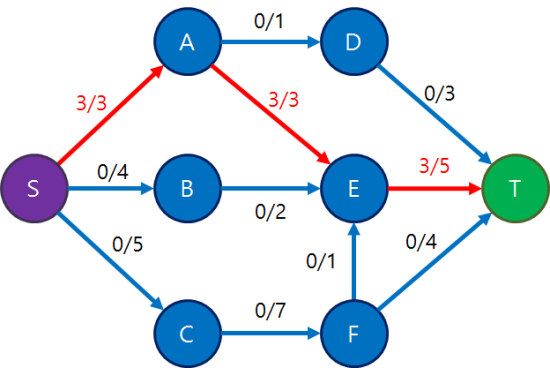
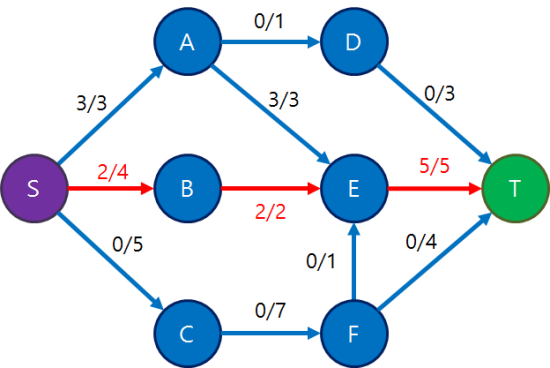

# 네트워크 유량(Network Flow) 

https://blog.naver.com/PostView.nhn?blogId=kks227&logNo=220804885235&parentCategoryNo=&categoryNo=299&viewDate=&isShowPopularPosts=false&from=postView


### 이론

네트워크 유량  

그래프의 간선의 거리, 시간이나 가중치  
즉 cost 대신에 용량(capacity)이라는 개념이 추가된다.  

정점 u,v를 잇는 간선(u,v)가 있을 때, 정점 u에서 v방향으로 간선의 용량 이하만큼의 유량(flow)를 흘려보낸다.  
또한 그래프에서 서로다른 두 정점인 소스(source),, 싱크(sink)정점이 정해지고,  
소스 정점에서 유량을 발생시켜서 간선들을 통해 싱크 정점에 도달시키는 것이 목표다.  
유량을 발생시킬수 있는건 소스 정점 뿐이고,  
그 외 정점들은 자신이 받은 유량만큼 다시 흘려보낼 수 있다.  



보통 유량그래프(flow network)는 방향 그래프인 경우가 많다. 물론, 무향 그래프일 수도 있다.  

위 그래프에서 적힌 숫자는 cost가아닌 capacity다.  
그리고 S가 소스, 정점 T가 싱크이다. 보통 소스가 S,싱크가 T로 표현된다.  



S에서 T로 유량을 1을 하나 보내본 예시다.  
각 간선의 p/q에서 p는 유량, q는 용량이다.  
S에 유량 1을 발생시켜서, 용량이 충분히 남아있는 경로를 찾아 T까지 보낸 사진이다.  
유량을 흘려보냄을 도중에 멈춰서는 안되고, 싱크까지 도달해야만한다.  



한 번 더 보낸 사진이다.  
여기서 간선(D,T)는 두 경로에 모두 포함되어 있어 두 번 보낸 유량이 모두 지나가고 있다.  



한 번 더 4를 보낸 사진이다.  
현재까지 S에서 T로 보낸 유량의 합은 1+1+4 =6이다.  
이 상황에서 경로 \[S,A,D,T]로 유량을 더 보낼 수 있을까?  
불가능하다.  
경로속에 속한 간선(D,T)에 더이상 용량이 남아있지 않기 떄문이다.  

유량그래프의 성질을 알아보자.  
1. 각 간선에 흐르는 유량은 그 간선의 용량을 넘어선 안된다. 즉, f(u,v) <= c(u,v)다.  
f,c는 flow, capacity이다.  
2. S와 T를 제외한 정점에서는 들어오는 유량 총합과 나가는 유량 총합이 같아야한다.  
즉, Σf(k, u) = Σf(u, l)이여야한다.  

S에는 유량이 발생하고, T에는 유량이 종착하여 더이상 나가지 않기 때문에 S에서 흘리는 유량의 합 또한 T에서 들어가는 유량의 합과 같다.
즉, Σf(S, k) = Σf(k, T)이다.  
3. 간선(u,v)방향으로 유량이 흐르고 있다면, 역방향으로는 음의 유량이 그만큼 흐르고 있다고 취급한다.  
즉, f(u, v) = -f(v, u)이다. 

유량그래프는 S에서 T로 가는 최단경로는 아니고, S에서 T로 동시에 보낼수 있는 물질의 양이 얼마나 될것이냐를 묻는것과 비슷하다.  

대역폭(badnwidth)의 개념과도 잘 맞아떨어진다.

하지만, 보통 이런 유량그래프가 주어지면 보통 최대유량(maximum flow)를 구한다.  
즉,S에서 T로 성질들을 해치지 않고 보낼 수 있는 최대유량이다.  



아까 그 그래프의 답은 7이고, 위와 같이 유량을 흘리면 된다.  

최대유량을 구하는 알고리즘은 정말 많고 시간복잡도도 다양하다.  
보통 짜기 쉬울수록 시간복잡도가 안좋다.  
지금도 매우 활발하게 연구가 진행중이다.  

포드 풀커슨 알고리즘(Ford-Fulkerson algorithm)은 기초중의 기초인 알고리즘이다.  
동작 방식은 다음과 같다.  

1. S에서 T로가는 증가경로(augmeting path)를 아무거나 하나 찾는다. 이 때, 증가 경로는 단순 경로이고, 경로상의 모든 간선에 아직 여유용량(residual)이 남아있다.  
즉, c(u,v) - f(u,v) > 0  
2. 증가 경로 중 차단 간선(blocking edge)을 찾는다. 이 간선은 경로상에서 c(u,v) - f(u,v)값이 최소인 간선이다. 많아봐야 이 만큼만 유량을 더 보낼수 있다. 이 값을 F라고 하자.  
3. 경로상의 모든 간선에 F만큼의 유량을 추가한다.  
즉, S에서 T로 이 경로를 따라서 F만큼의 유량을 새로 흘려보낸다. 경로상의 모든 간선에 대해 f(u,v) +=F  
그런데 세 번째 성질을 만족시키기 위해 f(v,u) -=F또한 행해야한다. 역방향으로는 상응하는 음의 유량을 흘려주는 것.  

위 과정을 더이상 증가경로가 없을 때까지 반복한다. 증가 경로를 찾고, 찾은 경로에 대해 가능한 많은 유량을 흘려내는 것의 반복이다.  

그래프에 간선(u,v)가 있지만 역방향 간선(v,u)는 없는데, 이를 그냥 (v,u)가 있긴 하지만 쓸모없는, 용량이 0인 간선으로 생각하자.  
아래 예제를 보자.  



이런 그래프가 있다고 하자.  
여기서 포드 풀커슨 알고리즘을 시행한다.  



일단 아무 증가경로를 하나 찾는다.
\[S,A,E,T]를 찾았는데, 경로가 여러개일 때, 그 중 하나를 고르는 기준은 없다.  
여기서 차단간선은 (S,A)이고 그 값이 3-0=3이므로 이 경로로 3의 유량을 흘려보낸다.  



그 다음, 또다른 경로 \[S,B,E,T]를 찾았늗네 차단간선(B,E)에 걸려 2의 유량을 보낸다.  


그 다음, 경로 \[S,C,F,T]를 찾아사 차단간선(F,T)에 의해 유량 4를 보낸다.  

이제 보기엔 더이상 증가경로가 있지 않아 보인다.  

정말 이게 끝일까?  
만약 맨처음에 경로[S,A,D,T]로 유량 1을 흘려보내고,  
그 다음 경로[S,A,E,T]로 유량 2를 흘려보내고,
경로 [S,B,E,T]로 유량 2, 경로 [S,C,F,T]로 유량 4를 흘려보냈으면  
아직 간선 (E,T)로 흐르는 유량이 4밖에 안되기 때문에  
경로 [S,C,F,E,T]로 유량 1을 추가로 흘려보낼 수 있어 지금보다 답이 크게나온다.  


### 문제


<!-- 

***

<details>

<summary>

#### _3648번: 아이돌_

</summary>

```cpp

```

</details> 


-->