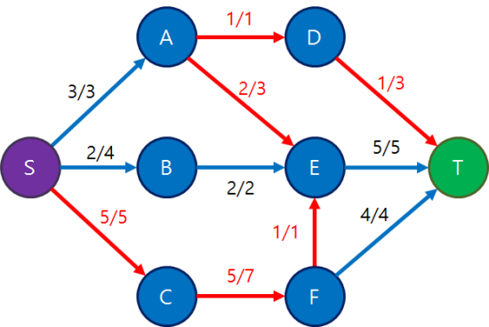

# 네트워크 유량(Network Flow) 

https://blog.naver.com/PostView.nhn?blogId=kks227&logNo=220804885235&parentCategoryNo=&categoryNo=299&viewDate=&isShowPopularPosts=false&from=postView


### 이론

네트워크 유량  

그래프의 간선의 거리, 시간이나 가중치  
즉 cost 대신에 용량(capacity)이라는 개념이 추가된다.  

정점 u,v를 잇는 간선(u,v)가 있을 때, 정점 u에서 v방향으로 간선의 용량 이하만큼의 유량(flow)를 흘려보낸다.  
또한 그래프에서 서로다른 두 정점인 소스(source),, 싱크(sink)정점이 정해지고,  
소스 정점에서 유량을 발생시켜서 간선들을 통해 싱크 정점에 도달시키는 것이 목표다.  
유량을 발생시킬수 있는건 소스 정점 뿐이고,  
그 외 정점들은 자신이 받은 유량만큼 다시 흘려보낼 수 있다.  


보통 유량그래프(flow network)는 방향 그래프인 경우가 많다. 물론, 무향 그래프일 수도 있다.  

위 그래프에서 적힌 숫자는 cost가아닌 capacity다.  
그리고 S가 소스, 정점 T가 싱크이다. 보통 소스가 S,싱크가 T로 표현된다.  


S에서 T로 유량을 1을 하나 보내본 예시다.  
각 간선의 p/q에서 p는 유량, q는 용량이다.  
S에 유량 1을 발생시켜서, 용량이 충분히 남아있는 경로를 찾아 T까지 보낸 사진이다.  
유량을 흘려보냄을 도중에 멈춰서는 안되고, 싱크까지 도달해야만한다.  


한 번 더 보낸 사진이다.  
여기서 간선(D,T)는 두 경로에 모두 포함되어 있어 두 번 보낸 유량이 모두 지나가고 있다.  


한 번 더 4를 보낸 사진이다.  
현재까지 S에서 T로 보낸 유량의 합은 1+1+4 =6이다.  
이 상황에서 경로 \[S,A,D,T]로 유량을 더 보낼 수 있을까?  
불가능하다.  
경로속에 속한 간선(D,T)에 더이상 용량이 남아있지 않기 떄문이다.  

유량그래프의 성질을 알아보자.  
1. 각 간선에 흐르는 유량은 그 간선의 용량을 넘어선 안된다. 즉, f(u,v) <= c(u,v)다.  
f,c는 flow, capacity이다.  
2. S와 T를 제외한 정점에서는 들어오는 유량 총합과 나가는 유량 총합이 같아야한다.  
즉, Σf(k, u) = Σf(u, l)이여야한다.  

S에는 유량이 발생하고, T에는 유량이 종착하여 더이상 나가지 않기 때문에 S에서 흘리는 유량의 합 또한 T에서 들어가는 유량의 합과 같다.
즉, Σf(S, k) = Σf(k, T)이다.  
3. 간선(u,v)방향으로 유량이 흐르고 있다면, 역방향으로는 음의 유량이 그만큼 흐르고 있다고 취급한다.  
즉, f(u, v) = -f(v, u)이다. 

유량그래프는 S에서 T로 가는 최단경로는 아니고, S에서 T로 동시에 보낼수 있는 물질의 양이 얼마나 될것이냐를 묻는것과 비슷하다.  

대역폭(badnwidth)의 개념과도 잘 맞아떨어진다.

하지만, 보통 이런 유량그래프가 주어지면 보통 최대유량(maximum flow)를 구한다.  
즉,S에서 T로 성질들을 해치지 않고 보낼 수 있는 최대유량이다.  


아까 그 그래프의 답은 7이고, 위와 같이 유량을 흘리면 된다.  

최대유량을 구하는 알고리즘은 정말 많고 시간복잡도도 다양하다.  
보통 짜기 쉬울수록 시간복잡도가 안좋다.  
지금도 매우 활발하게 연구가 진행중이다.  

포드 풀커슨 알고리즘(Ford-Fulkerson algorithm)은 기초중의 기초인 알고리즘이다.  
동작 방식은 다음과 같다.  

1. S에서 T로가는 증가경로(augmeting path)를 아무거나 하나 찾는다. 이 때, 증가 경로는 단순 경로이고, 경로상의 모든 간선에 아직 여유용량(residual)이 남아있다.  
즉, c(u,v) - f(u,v) > 0  
2. 증가 경로 중 차단 간선(blocking edge)을 찾는다. 이 간선은 경로상에서 c(u,v) - f(u,v)값이 최소인 간선이다. 많아봐야 이 만큼만 유량을 더 보낼수 있다. 이 값을 F라고 하자.  
3. 경로상의 모든 간선에 F만큼의 유량을 추가한다.  
즉, S에서 T로 이 경로를 따라서 F만큼의 유량을 새로 흘려보낸다. 경로상의 모든 간선에 대해 f(u,v) +=F  
그런데 세 번째 성질을 만족시키기 위해 f(v,u) -=F또한 행해야한다. 역방향으로는 상응하는 음의 유량을 흘려주는 것.  

위 과정을 더이상 증가경로가 없을 때까지 반복한다. 증가 경로를 찾고, 찾은 경로에 대해 가능한 많은 유량을 흘려내는 것의 반복이다.  

그래프에 간선(u,v)가 있지만 역방향 간선(v,u)는 없는데, 이를 그냥 (v,u)가 있긴 하지만 쓸모없는, 용량이 0인 간선으로 생각하자.  
아래 예제를 보자.  


이런 그래프가 있다고 하자.  
여기서 포드 풀커슨 알고리즘을 시행한다.  


일단 아무 증가경로를 하나 찾는다.
\[S,A,E,T]를 찾았는데, 경로가 여러개일 때, 그 중 하나를 고르는 기준은 없다.  
여기서 차단간선은 (S,A)이고 그 값이 3-0=3이므로 이 경로로 3의 유량을 흘려보낸다.  


그 다음, 또다른 경로 \[S,B,E,T]를 찾았늗네 차단간선(B,E)에 걸려 2의 유량을 보낸다.  


그 다음, 경로 \[S,C,F,T]를 찾아사 차단간선(F,T)에 의해 유량 4를 보낸다.  

이제 보기엔 더이상 증가경로가 있지 않아 보인다.  

정말 이게 끝일까?  
만약 맨처음에 경로[S,A,D,T]로 유량 1을 흘려보내고,  
그 다음 경로[S,A,E,T]로 유량 2를 흘려보내고,
경로 [S,B,E,T]로 유량 2, 경로 [S,C,F,T]로 유량 4를 흘려보냈으면  
아직 간선 (E,T)로 흐르는 유량이 4밖에 안되기 때문에  
경로 [S,C,F,E,T]로 유량 1을 추가로 흘려보낼 수 있어 지금보다 답이 크게나온다.  

사실, 아직 이 그래프에 증가경로가 존재한다.  



아까 세 번째 성질에서 f(u,v) = -f(v,u)라고 했다.  
간선 (u,v)가 존재한다면 c(u,v)가 양수고 c(v,u)는 0으로 취급한다.  
따라서 , 그래프에서는 없는 간선이지만 가상으로 있는, 간선(A,E)의 역방향 간선(E,A)를 봐보자.  
이 간선의 용량은 0인데, 여기로 지금 -3만큼의 유량이 흐르고 있다.  
따라서 c(E,A)- f(E,A) = 0 - (-3) = 3>0 이 된다.  
따라서 이 가상의 간선 (E,A)로 유량을 흘려보내는게 가능해진다.  


이렇게 경로 [S,C,F,E,A,D,T]를 찾는 것이 가능해지며 이 때 유량을 1을 추가로 흘려보낼 수 있다. 간선 (E,A0방향으로 유량이 1 흘렀기 때문에, 실제로 존재하던 간선(A,E)로 흐르던유ㅑㄹㅇ은 반대로 1 감소하는 효과가 생긴다.  

이는 유량을 상쇄시키는 효과다.  
<원래 정점 A에서 E로 흘려보내던 유량 3중에서 1을 철수해서 다른 정점인 D로 흐려보내게 되었다.>라고 생각할 수 있다.  
그 경로는 지금의 경우 마지막에 찾은 [S,C,F,E,A,D,T]중에서 정점 A이후에 이어지는 부분 경로인[A,D,T]가 된다.  
이 경로는 맨 처음에 A에서 선택했떤 경로[A,E,T]와 다른 방향의 겨로고, 이 경로를 뒤늦게 지나가도록 유량 일부를 돌려보낸것이다.  
또한 이번에 찾은 경로는 첫 번째로 찾은 경로에서 원래 사용하던 [E,T]부분을 대신 사용하여 유량을 흘려보낸것이다. 즉, 서로 경로를 바꿔서 사용하고있다.  

첫번째로 찾았던 경로[S,A,E,T], 마지막 경로 [S,C,F,E,A,D,T]가 엇갈리면서 실제로는 처음부터 두 경로 [S,A,D,T]와 [S,C,F,E,T]로 각각 유량 1, 1을 보낸 것이나 마찬가지다.  

이 두 경로는 원래 경로에서 간선 (A,E) (E,A) 전후 경로를 스왑한 형태다. 그리고 서로가 간선 (A,E), (E,A)를 더이상 사용하지 않게 됐다.  
간선 (A,E)쪽으로 유량을 흘리다가 다시 (E,A)쪽으로 유량을 흘려보내는건 그냥 정점 A로 되돌아가는것과 같다.  
따라서, 이렇게 가능한 모든 경로를 찾고 알고리즘은 종료된다. 최대 유량은 1+5+4 = 10이다.  

이 알고리즘에서 증가경로를 찾는 방법은 DFS이다. DFS의 시간복잡도는 매번 O(V+E)이다. 이 문제의 답이 f고, 모든 용량 단위가 정수라고 할 때 한 번 경로를 찾았을때 유량이 최소 1씩은 보내지므로, 증가 경로를 찾는 루프는 최대 f번 실행된다.  
따라서 포드풀커슨 알고리즘의 시간복잡도는 O((V+E)f)다. 보통 V보다 E가 더 크기 때문에 O(Ef)라고 축약해서 쓴다.  


하지만, 이런 낭비상황이 발생하기도 한다.  


이런 그래프가 있다고 하자.  
경로[S,A,T]와 [S,B,T]만 찾으면 총합 2000의 답을 찾을 수 있지만,


dfs가 이렇게 경로[S,A,B,T]를 찾았고 유량 1만 흘렸다고 하자.  


그 다음에는 [S,B,A,T]를 찾아서 또 1을 흘린다.


그러더니 [S,A,B,T]로 1을 흘린다.  


이렇게 되면 2000번 루프를 돌려야한다.  


만약 이런 f,c면 답이없다...  


그래서 더 좋은 알고리즘이 필요하다.  
단지 증가경로를 DFS가 아니라 BFS로 찾아서,  
S에서 T로 가는 그때그떄의 가장 짧은 경로를 찾아내는 방식을 쓰면 시간복잡도가 최대O(VE^2)로 줄어든다.  
이게 에드몬드 카프 알고리즘(Edmonds-Karp algorithm)이다.  


https://www.acmicpc.net/problem/6086
요 문제를 봐보자.  
각 정점이 알파벳 대소문자 한 글자로 표현되므로 정점은 최대 52개고  
언제나 소스는 'A', 싱크는 'Z'이며 간선 개수도 최대 700개. 또한 각 용량값도 최대 1,000.  
최대 유량 알고리즘을 연습하기 딱 좋다.  
그런데, 똑같은 간선 (a, b)가 짖궂게도 여러 개 존재할 수 있다.  


```cpp
#include <cstdio>
#include <vector>
#include <queue>
#include <algorithm>
using namespace std;
const int MAX_V = 52;
const int INF = 1000000000;
 
// 정점 문자를 0~51 사이의 번호로 바꿔주는 간단한 함수
inline int CtoI(char c){
    if(c <= 'Z') return c - 'A';
    return c - 'a' + 26;
}
 
int main(){
    int N; // 간선 개수
    int c[MAX_V][MAX_V] = {0}; // c[i][j]: i에서 j로 가는 간선의 용량
    int f[MAX_V][MAX_V] = {0}; // f[i][j]: i에서 j로 현재 흐르는 유량
    vector<int> adj[MAX_V]; // 인접 리스트
 
    // 간선 정보 입력받기
    scanf("%d", &N);
    for(int i=0; i<N; i++){
        char u, v;
        int w;
        scanf(" %c %c %d", &u, &v, &w);
        u = CtoI(u); v = CtoI(v);
        c[u][v] = c[v][u] += w; // 같은 간선이 여러 번 들어올 수 있으므로 +=
        adj[u].push_back(v);
        adj[v].push_back(u); // 역방향 간선도 추가해줘야 함
    }
 
    // total: 총 유량, S: 소스, E: 싱크
    int total = 0, S = CtoI('A'), E = CtoI('Z');
    // 증가 경로를 못 찾을 때까지 루프
    while(1){
        // 증가 경로를 BFS로 찾음
        int prev[MAX_V];
        fill(prev, prev+MAX_V, -1);
        queue<int> Q;
        Q.push(S);
        while(!Q.empty() && prev[E] == -1){
            int curr = Q.front();
            Q.pop();
            for(int next: adj[curr]){
                // c[i][j]-f[i][j] > 0: i에서 j로 유량을 흘릴 여유가 남았는가?
                // prev[next] == -1: next 정점을 아직 방문하지 않았는가?
                if(c[curr][next]-f[curr][next] > 0 && prev[next] == -1){
                    Q.push(next);
                    prev[next] = curr; // 경로를 기억하기 위해 prev 배열 사용
                    if(next == E) break; // 싱크에 도달하면 나옴
                }
            }
        }
        // 싱크로 가는 경로가 더 없으면 루프 탈출
        if(prev[E] == -1) break;
 
        // 경로상에서 가장 허용치가 낮은 곳을 찾음
        int flow = INF;
        for(int i=E; i!=S; i=prev[i])
            flow = min(flow, c[prev[i]][i]-f[prev[i]][i]);
        // 찾은 flow만큼 해당 경로에 유량 흘려줌
        for(int i=E; i!=S; i=prev[i]){
            f[prev[i]][i] += flow;
            f[i][prev[i]] -= flow;
        }
        // 총 유량 값 증가
        total += flow;
    }
    // 결과 출력
    printf("%d\n", total);
}
[출처] 네트워크 유량(Network Flow) (수정: 2019-08-14)|작성자 라이


```


매번 가능한 증가 경로를 찾고, 찾으면 가능한 만큼 유량을 흘려보낸다.  
이 때 증가 경로는 BFS로 찾는다.  
용량과 유량값을 배열로 사용해도 좋지만, V값이 너무 크면 O(V^2)의 공간이 부족할수도 있다. 그 때는 간선을 필요한만큼 만들어 써야한다.   


초반에 가장 많이 하게되는 실수는 역방향간선을 추가하지 않는 것이다.  
간선(u,v)가 들어오면 반드시 v쪽에도 인접리스트에 u를 넣어서 역방향 간선을 만들어 줘야한다.  


```cpp

#include <cstdio>
#include <vector>
#include <queue>
#include <algorithm>
using namespace std;
const int MAX_V = 52;
const int INF = 1000000000;
 
// 간선 구조체
struct Edge{
    int to, c, f;
    Edge *dual; // 자신의 역방향 간선을 가리키는 포인터
    Edge(): Edge(-1, 0){}
    Edge(int to1, int c1): to(to1), c(c1), f(0), dual(nullptr){}
    int spare(){
        return c - f;
    }
    void addFlow(int f1){ // 자신과 역방향 간선에 f1만큼의 플로우 값을 갱신
        f += f1;
        dual->f -= f1;
    }
};
 
inline int CtoI(char c){
    if(c <= 'Z') return c - 'A';
    return c - 'a' + 26;
}
 
int main(){
    int N;
    vector<Edge*> adj[MAX_V]; // 존재하는 간선만을 인접 리스트로 저장
    // 간선 정보 입력받음
    scanf("%d", &N);
    for(int i=0; i<N; i++){
        char u, v;
        int w;
        scanf(" %c %c %d", &u, &v, &w);
        u = CtoI(u); v = CtoI(v);
        Edge *e1 = new Edge(v, w), *e2 = new Edge(u, 0);
        e1->dual = e2;
        e2->dual = e1;
        adj[u].push_back(e1);
        adj[v].push_back(e2);
    }
 
    int total = 0, S = CtoI('A'), E = CtoI('Z');
    while(1){
        int prev[MAX_V];
        Edge *path[MAX_V] = {0}; // 경로상의 간선들을 저장해두어 나중에 참조
        fill(prev, prev+MAX_V, -1);
        queue<int> Q;
        Q.push(S);
        while(!Q.empty() && prev[E] == -1){
            int curr = Q.front();
            Q.pop();
            for(Edge *e: adj[curr]){
                int next = e->to;
                if(e->spare() > 0 && prev[next] == -1){
                    Q.push(next);
                    prev[next] = curr;
                    path[next] = e;
                    if(next == E) break;
                }
            }
        }
        if(prev[E] == -1) break;
 
        int flow = INF;
        for(int i=E; i!=S; i=prev[i])
            flow = min(flow, path[i]->spare());
        for(int i=E; i!=S; i=prev[i])
            path[i]->addFlow(flow);
        total += flow;
    }
    printf("%d\n", total);
}
```

필요한 간선만을 구조체로 정의해서 저장하는 코드다.  
구현하는 방법은 굉장히 많지만 가장 골치아픈건 역방향 간선을 가능한 빠르게 참조하는거다.  
처음부터 간선을 두 방향 모두 만들어서 서로를 가리키고 있게 만들자. dual 포인터가 그 역할을 하고 있다.  

방향이 없는 그래프에서도 최대 유량을 찾는게 가능하다.  
간선 (u,v)에 방향은 없지만, u에서 v로만 유량을 흘리거나 v에서 u로만 유량을 흘리는게 가능하다.  
그냥 양쪽 용량을 같은 값으로 초기화해 두기만 하면 구현이 된다. 유량을 역방향에는 빼주는 건 똑같이 해야 한다.   


### 문제


<!-- 

***

<details>

<summary>

#### _3648번: 아이돌_

</summary>

```cpp

```

</details> 


-->

* [6086번: Total Flow](https://www.acmicpc.net/problem/6086)   
* [2188번: 축사 배정](https://www.acmicpc.net/problem/2188)   
* [17412번: 도시 왕복하기](https://www.acmicpc.net/problem/17412)   
* [2316번: 도시 왕복하기 2 (★)](https://www.acmicpc.net/problem/2316)   
* [7616번: 교실로 가는 길 (★)](https://www.acmicpc.net/problem/7616)   
* [5651번: Crucial Links (★)](https://www.acmicpc.net/problem/5651)   
* [1658번: 돼지 잡기](https://www.acmicpc.net/problem/1658)   
* [11495번: 격자 0 만들기 (★)](https://www.acmicpc.net/problem/11495)   
* [10319번: Avoiding the Apocalypse (★)](https://www.acmicpc.net/problem/10319)   
* [3666번: 리스크 (★)](https://www.acmicpc.net/problem/3666)   


***

<details>

<summary>

#### _3648번: 아이돌_

</summary>

```cpp

```

</details> 