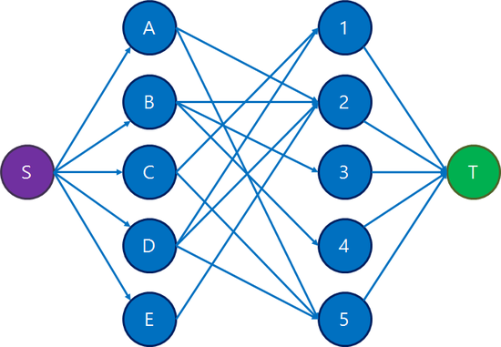

# 이분 매칭(Bipartite Matching)

https://blog.naver.com/PostView.nhn?blogId=kks227&logNo=220807541506&parentCategoryNo=&categoryNo=299&viewDate=&isShowPopularPosts=false&from=postView

### 이론

유량 그래프의 아주 특수하면서 메이저한 형태 하나를 다뤄보자.  

https://www.acmicpc.net/problem/2188  

축사배정 문제다.  

  

그래프 형태가 이러했고, 이런 형태가 상당히 특수하고 자주 나타난다.(모든 간선의 용량은 1이다)   
여기서 왼쪽열의 정점들은 모두 소스에서 갈수있고, 오른쪽열의 정점들은 모두 싱크로 갈수 있다.   
그 외의 간선은 모두 왼쪽열에서 오른쪽으로 가는 것 뿐이다.  

이 그래프를 좀 바꾸면  
  
이런 형태로 축약하는 것이 가능하다.  

정점을 두 개의 그룹으로 나누었을 때, 존재하는 모든 간선의 양 끝 정점이 서로 다른 그룹에 속하는 형태의 그래프를 *이분 그래프(bipartite graph)*라고 한다.   
이분 그래프에서 한쪽 그룹을 A, 다른 쪽 그룹을 B라고 할 때, 각 A 정점으로 가는 간선, 각 B정점에서 싱크로 가는 간선들이 추가되고( 이 간선들의 용량은 모두 1) A,B그룹 사이의 방향은 모두 A->B일때 최대유량을 구하는 문제를 *이분 매칭(bipartite matching)*문제라고 한다.   

여기서 이분 매칭 문제의 답은, 축약된 이분 그래프에서 *매칭(matching)*의 최대 개수와 같다. 이걸 *최대매칭(maximum matching)*이라 한다.   

매칭은 간선 하나를 선택하는 것이고, 이 때 간선을 선택하면 양 끝 정점도 같이 선택하는 것이나 마찬가지고, 각 정점은 한 번까지만 선택될 수 있다.  

따라서 위 그래프에선 간선 (A,2), (A,5)를 동시에 선택하는, 혹은 매칭시키는 것은 불가능하다. A를 두번 선택하게되기 때문이다.   
각 정점을 한번까지만 선택할 수 있는 조건은 소스, 싱크와 이어진 간선 용량이 모두 1이라는 점에서 구현된다.   
지금 이분 매칭 문제를 표현하고 있는 이분 그래프에서 그려지지 않은 부분은 항상 어차피 같은 형태기 때문에 생략한 것이다.   

이분 그래프만이 갖는 아주 단순한 구조와 거기서 파생되는 특성들 때문에, 최대 O(VE) 시간으로 빠르게 최대매칭 개수를 구하는 최적화가 존재한다.여기서 V는 양쪽 그룹 중 큰 쪽의 크기라 하자. 그냥 플로우 그래프로 두고 에드몬드 카프 알고리즘을 돌리면 min(O(VE^2),O(Ef))인데, f가 최대 O(V)이므로 O(VE)의 시간 복잡도가 발생하고 이와 동일하다.   

이분 그래프에서 왼쪽그룹을 A, 오른쪽 그룹을 B라고 하자. 포드 풀커슨이건 에드모든 카프건, 일단 알고리즘을 돌리면 소스 s에서 시작하는 경로를 찾기 위해 첫번째로 방문하는 노드는 A에속하는 정점일 것이다.  이를 a라 하자.   
그리고 a에서 방문 가능한 정점은 반드시 B에 속한다. 이를 b라 하자.   
b에서는 일단 싱크 t로밖에 갈 수 없다. 기본적인 경로는 s->a->b->t꼴이다. 그러나 b에서 음의 유량이 흐르는 경로를 찾아서 A에 속하는 정점으로 갈수도 있을 것이다.
이게 반복되면 s->a->b->a'->b'->t, s->a->b->a'->b'->a''->b''->t, ... 식의 경로들이 발생 가능하다. A,B에 속하는 정점들이 반드시 교차되어 나타난다.  
양쪽 끝의 s,t는 어차피 정해져있으니 생략하고, 중간 과정을 최대한 간소화하자는 것이 아이디어다.   
  
정점은 A 그룹의 것을 순서대로 훑으면서 아직 매칭이 안된 정점이 있으면 매칭을 시도한다. 또한 인접 리스트의 원소들(B그룹에 속함) 역시 위부터 아래로 정렬되어있다고 하자.   

맨 처음에는 (A,2)매칭이 바로 이어진다.  

   

그 다음, B의 인접원소가 {2,3,4}고 그 중 2가 이미 A와 매칭된 상태다. A를 2대신 다른 정점과 매칭시킬 수 있나 탐색한다. 5와 매칭이 가능하므로 매칭(A,2)가 소거되고 새로운 매칭(B,2),(A,5)가 생성된다.   

이 때, 매칭을 하는데 성공했다는 말은 반드시 현재까지에 이어 매칭 수를 1증가시켰다는 말이다.  만약 이런식으로 원래 매칭상대이던 정점을 다른 정점과 매칭시키는 식으로 짝을 다시 지어주는 것이 불가능하면 실패다.   
    

그 다음, C를 1과 잇는다.  

  
D를 건드리니까 (C,1)이 소거되고 C를 5와 매칭시키고, 원래 매칭이던 (A,5)가 사라지고 A는 다른 짝 2를 찾았으며, 그에 따라 (B,2)도 사라졌지만, B가 마지막으로 매칭 (B,3)을 찾아서 매칭 재배치를한다.

E의 경우, 매칭을 더이상 만들 수 없다.  
일단 유일한 인접원소가 2인데, 2와 매칭되어있던 A를 대신 5와 매칭시키고, 5와 매칭되어있던 C를 1과, 1과 매칭되어있던 D를 2 또는 5와 매칭시켜야하는데, 2는 이번에 이미 E와 매칭되어있으므로 더이상 매칭 시킬 수 없고, 5 역시 이미 A와 매칭되어있으므로 더 이상 매칭시킬수 없다. 따라서 dead end가 발생하고 새로운 매칭을 형성시킬 수 없다. 만약 E의 인접원소가 더 있었더라면 다른 원소와 매칭 시도를 해볼 수 있겠지만, 그것 조자 실패할 수도있다.   
이렇게 최종적인답은 4이다.  


```cpp

#include <cstdio>
#include <vector>
#include <algorithm>
using namespace std;
const int MAX = 200;
 
// N: A 그룹 크기, M: B 그룹 크기
// A[i], B[i]: 각 정점이 매칭된 반대편 정점 번호
int N, M, A[MAX], B[MAX];
// adj[i]: A[i]와 인접한 그룹 B의 정점들
vector<int> adj[MAX];
bool visited[MAX];
 
// A그룹에 속한 정점 a를 이분 매칭시켜서 성공하면 true
bool dfs(int a){
    visited[a] = true;
    for(int b: adj[a]){
        // 반대편이 매칭되지 않았거나
        // 매칭되어 있었지만 원래 매칭되어 있던 정점을 다른 정점과 매칭시킬 수 있으면 성공
        if(B[b] == -1 || !visited[B[b]] && dfs(B[b])){
            A[a] = b;
            B[b] = a;
            return true;
        }
    }
    // 매칭 실패
    return false;
}
 
int main(){
    scanf("%d %d", &N, &M);
    for(int i=0; i<N; i++){
        int S;
        scanf("%d", &S);
        for(int j=0; j<S; j++){
            int k;
            scanf("%d", &k);
            adj[i].push_back(k-1);
        }
    }
 
    int match = 0;
    // 초기값: -1
    fill(A, A+N, -1);
    fill(B, B+M, -1);
    for(int i=0; i<N; i++){
        // 아직 매칭되지 않은 그룹 A 정점에 대해 매칭 시도
        if(A[i] == -1){
            // visited 배열 초기화
            fill(visited, visited+N, false);
            if(dfs(i)) match++;
        }
    }
    printf("%d\n", match);
}
[출처] 이분 매칭(Bipartite Matching)|작성자 라이

```


### 문제


* [2188번: 축사 배정](https://www.acmicpc.net/problem/2188)   
* [11375번: 열혈강호](https://www.acmicpc.net/problem/11375)   
* [9576번: 책 나눠주기](https://www.acmicpc.net/problem/9576)   
* [1298번: 노트북의 주인을 찾아서](https://www.acmicpc.net/problem/1298)   
* [11376번: 열혈강호 2](https://www.acmicpc.net/problem/11376)   
* [11377번: 열혈강호 3](https://www.acmicpc.net/problem/11377)   
* [1017번: 소수 쌍 (★)](https://www.acmicpc.net/problem/1017)   
* [9577번: 토렌트 (★)](https://www.acmicpc.net/problem/9577)   
* [3295번: 단방향 링크 네트워크 (★)](https://www.acmicpc.net/problem/3295)   
* [1671번: 상어의 저녁식사 (★)](https://www.acmicpc.net/problem/1671)   
* [1574번: 룩 어택](https://www.acmicpc.net/problem/1574)   
* [9525번: 룩 배치하기 (★)](https://www.acmicpc.net/problem/9525)   
* [2570번: 비숍 2 (★)](https://www.acmicpc.net/problem/2570)   
* [1348번: 주차장 (★)](https://www.acmicpc.net/problem/1348)   

<!-- 

***

<details>

<summary>

#### _11376번: 열혈강호 2_

</summary>

```cpp

```

</details> 


-->

***

<details>

<summary>

#### _2188번: 축사 배정_

이분매칭 기본문제


</summary>

```cpp
#include <bits/stdc++.h>
using namespace std;
#define fastio ios_base::sync_with_stdio(false), cin.tie(NULL), cout.tie(NULL)
#define debug freopen("input.txt", "r", stdin), freopen("output.txt", "w", stdout)
#define sz(x) (int)(x).size()
#define all(x) (x).begin(), (x).end()
#define rall(x) (x).rbegin(), (x).rend()
#define o1 first
#define o2 second
typedef pair<int,int> pii;
typedef tuple<int,int,int> tiii;
// #define int int64_t
/* ⁽⁽◝( ˙ ꒳ ˙ )◜⁾⁾ ⁽⁽◝( ˙ ꒳ ˙ )◜⁾⁾ ⁽⁽◝( ˙ ꒳ ˙ )◜⁾⁾
    2021.01.28 Thu
    comment: 
    

⁽⁽◝( ˙ ꒳ ˙ )◜⁾⁾ ⁽⁽◝( ˙ ꒳ ˙ )◜⁾⁾ ⁽⁽◝( ˙ ꒳ ˙ )◜⁾⁾*/

const int MAX = 200;

// N: A 그룹 크기, M: B 그룹 크기
// A[i],B[i] : 각 정점이 매칭된 반대편 정점 번호
int N,M,A[MAX],B[MAX];
// adj[i] : A[i]와 인접한 그룹 B의 정점들
vector<int> adj[MAX];
bool visited[MAX];

// A그룹에 속한 정점 a를 이분 매칭시켜서 성공하면 true 반환
bool dfs(int a){
    visited[a] = true;

    for(int b : adj[a]){
        // 반대편이 매칭되지 않았거나
        // 매칭되어 있었지만 원래 매칭되어있던 정점을 다른 정점과 매칭 시킬 수 있으면 성공
        if(B[b] == -1 || (!visited[B[b]] && dfs(B[b]))){
            A[a] = b;
            B[b] = a;
            return true;
        }
    }

    return false;
}


void solve(){
    cin >> N >> M;
    for(int i=0; i < N; i++){
        int S; cin >> S;
        for(int j=0; j < S;j ++){
            int k; cin >> k; k--;
            adj[i].push_back(k);
        }
    }
    int match =0;
    fill(A,A+N,-1);
    fill(B,B+M,-1);
    for(int i=0; i < N; i++){
        // 아직 매칭되지 않은 그룹 A 정점A[i]에 대해
        if(A[i] == -1){
            // visited배열 초기화
            fill(visited,visited+N,false);
            // 만약 매칭이 가능하면 매칭++;
            if(dfs(i)) match++;
        }
    }
    cout << match;

}


int32_t main() {
    int t=1;
    fastio;
    // debug;
    {
        // cin >> t; 
        for(int i=1; i <= t; i++) solve();
    }
}

```

</details> 

***

<details>

<summary>

#### _11375번: 열혈강호_

이분매칭 기본문제 2

</summary>

```cpp

#include <bits/stdc++.h>
using namespace std;
#define fastio ios_base::sync_with_stdio(false), cin.tie(NULL), cout.tie(NULL)
#define debug freopen("input.txt", "r", stdin), freopen("output.txt", "w", stdout)
#define sz(x) (int)(x).size()
#define all(x) (x).begin(), (x).end()
#define rall(x) (x).rbegin(), (x).rend()
#define o1 first
#define o2 second
typedef pair<int,int> pii;
typedef tuple<int,int,int> tiii;
// #define int int64_t
/* ⁽⁽◝( ˙ ꒳ ˙ )◜⁾⁾ ⁽⁽◝( ˙ ꒳ ˙ )◜⁾⁾ ⁽⁽◝( ˙ ꒳ ˙ )◜⁾⁾
    2021.01.28 Thu
    comment: 
    
    bipartite matching
    

⁽⁽◝( ˙ ꒳ ˙ )◜⁾⁾ ⁽⁽◝( ˙ ꒳ ˙ )◜⁾⁾ ⁽⁽◝( ˙ ꒳ ˙ )◜⁾⁾*/
const int MAX =1001;
int N,M,here[MAX],there[MAX];
vector<int> adj[MAX];
bool vi[MAX];

bool dfs(int me){
    vi[me] = true;

    for(auto you : adj[me]){
        if(there[you] == -1 || (!vi[there[you]] && dfs(there[you]))){
            here[me] = you;
            there[you] = me;
            return true;
        }
    }
    return false;
}


void solve(){
    cin >> N>> M;
    memset(here,-1,sizeof(here));
    memset(there,-1,sizeof(there));

    for(int i=0; i < N; i++){
        int t; cin >>t ; while(t--){
            int a; cin >> a; a--;
            adj[i].push_back(a);
        }
    }
    int ans=0;
    for(int i=0; i <N; i++){
        if(here[i] == -1){
            memset(vi,0,sizeof(vi));
            if(dfs(i)) ans++;
        }
    }
    cout << ans;
}


int32_t main() {
    int t=1;
    fastio;
    // debug;
    {
        // cin >> t; 
        for(int i=1; i <= t; i++) solve();
    }
}

```

</details> 

***

<details>

<summary>

#### _9576번: 책 나눠주기_

이분매칭 기본문제 3

</summary>

```cpp

#include <bits/stdc++.h>
using namespace std;
#define fastio ios_base::sync_with_stdio(false), cin.tie(NULL), cout.tie(NULL)
#define debug freopen("input.txt", "r", stdin), freopen("output.txt", "w", stdout)
#define sz(x) (int)(x).size()
#define all(x) (x).begin(), (x).end()
#define rall(x) (x).rbegin(), (x).rend()
#define o1 first
#define o2 second
typedef pair<int,int> pii;
typedef tuple<int,int,int> tiii;
// #define int int64_t
/* ⁽⁽◝( ˙ ꒳ ˙ )◜⁾⁾ ⁽⁽◝( ˙ ꒳ ˙ )◜⁾⁾ ⁽⁽◝( ˙ ꒳ ˙ )◜⁾⁾
    2021.01.28 Thu
    comment: 
    bipartite matching
    

⁽⁽◝( ˙ ꒳ ˙ )◜⁾⁾ ⁽⁽◝( ˙ ꒳ ˙ )◜⁾⁾ ⁽⁽◝( ˙ ꒳ ˙ )◜⁾⁾*/
const int MAX=1001;
int N,M,here[MAX],there[MAX];
vector<int> adj[MAX];
bool vi[MAX];


bool dfs(int me){
    vi[me] = true;

    for(auto you : adj[me]){
        if(there[you] == -1 || (!vi[there[you]] && dfs(there[you]))){
            here[me] = you;
            there[you] =me;
            return true;
        }
    }
    return false;
}


void solve(){
    int T; cin>> T; while(T--){

    memset(adj,0,sizeof(adj));
    cin >> N>> M;
    for(int i= 0 ; i< M; i++){
        int a,b;
        cin >> a >> b; a--;b--;
        for(int j=a; j <= b; j++){
            adj[i].push_back(j);
        }
    }
    memset(here,-1,sizeof(here));
    memset(there,-1,sizeof(there));

    int ans =0;
    for(int i=0; i <M ;i++){
        if(here[i] == -1){
            memset(vi,0,sizeof(vi));
            if(dfs(i)) ans++;
        }
    }
    cout << ans << '\n';

    }
}


int32_t main() {
    int t=1;
    fastio;
    // debug;
    {
        // cin >> t; 
        for(int i=1; i <= t; i++) solve();
    }
}

```

</details> 

***

<details>

<summary>

#### _1298번: 노트북의 주인을 찾아서_

이분매칭 기본문제 4

</summary>

```cpp

#include <bits/stdc++.h>
using namespace std;
#define fastio ios_base::sync_with_stdio(false), cin.tie(NULL), cout.tie(NULL)
#define debug freopen("input.txt", "r", stdin), freopen("output.txt", "w", stdout)
#define sz(x) (int)(x).size()
#define all(x) (x).begin(), (x).end()
#define rall(x) (x).rbegin(), (x).rend()
#define o1 first
#define o2 second
typedef pair<int,int> pii;
typedef tuple<int,int,int> tiii;
// #define int int64_t
/* ⁽⁽◝( ˙ ꒳ ˙ )◜⁾⁾ ⁽⁽◝( ˙ ꒳ ˙ )◜⁾⁾ ⁽⁽◝( ˙ ꒳ ˙ )◜⁾⁾
    2021.01.28 Thu
    comment: 
    bipartite matching
    

⁽⁽◝( ˙ ꒳ ˙ )◜⁾⁾ ⁽⁽◝( ˙ ꒳ ˙ )◜⁾⁾ ⁽⁽◝( ˙ ꒳ ˙ )◜⁾⁾*/

const int MAX = 101;
int N,M,here[MAX],there[MAX];
bool vi[MAX];
vector<int> adj[MAX];

bool dfs(int me){
    vi[me] = true;

    for(auto you : adj[me]){
        int cand =there[you];
        if(cand == -1 || (!vi[cand] && dfs(cand))){
            here[me] = you;
            there[you] = me;
            return true;
        }
    }
    return false;
}

void solve(){
    cin >> N >> M;
    for(int i=0; i <  M; i++){
        int a,b; cin >> a >> b; a--; b--;
        adj[a].push_back(b);
    }
    memset(here,-1,sizeof(here));
    memset(there,-1,sizeof(there));

    int ans=0;
    for(int i=0; i < N ;i ++){
        if(here[i] == -1){
            memset(vi,0,sizeof(vi));
            ans += dfs(i);
        }
    }
    cout << ans;
}


int32_t main() {
    int t=1;
    fastio;
    // debug;
    {
        // cin >> t; 
        for(int i=1; i <= t; i++) solve();
    }
}

```

</details> 


***

<details>

<summary>

#### _11376번: 열혈강호 2_

모델링을 해야한다.  
각 직원이 2개씩 일을 할 수 있으니  
기준정점집합의 정점갯수를 두배로 늘리자
</summary>

```cpp

#include <bits/stdc++.h>
using namespace std;
#define fastio ios_base::sync_with_stdio(false), cin.tie(NULL), cout.tie(NULL)
#define debug freopen("input.txt", "r", stdin), freopen("output.txt", "w", stdout)
#define sz(x) (int)(x).size()
#define all(x) (x).begin(), (x).end()
#define rall(x) (x).rbegin(), (x).rend()
#define o1 first
#define o2 second
typedef pair<int,int> pii;
typedef tuple<int,int,int> tiii;
// #define int int64_t
/* ⁽⁽◝( ˙ ꒳ ˙ )◜⁾⁾ ⁽⁽◝( ˙ ꒳ ˙ )◜⁾⁾ ⁽⁽◝( ˙ ꒳ ˙ )◜⁾⁾
    2021.01.28 Thu
    comment: 
    bipartite matching
    

⁽⁽◝( ˙ ꒳ ˙ )◜⁾⁾ ⁽⁽◝( ˙ ꒳ ˙ )◜⁾⁾ ⁽⁽◝( ˙ ꒳ ˙ )◜⁾⁾*/

const int MAX =1001 *2;
int N,M,here[MAX],there[MAX];
vector<int> adj[MAX];
bool vi[MAX];

bool dfs(int me){
    vi[me] = true;

    for(auto you : adj[me]){
        int cand = there[you];
        if(cand == -1 || (!vi[cand] && dfs(cand))){
            here[me] = you;
            there[you] = me;
            return true;
        }
    }
    return false;
}


void solve(){
    cin >> N>> M;
    for(int i=0; i < N; i++){
        int t;cin >> t; while(t--){
            int a; cin >> a; a--;
            adj[i*2].push_back(a);
            adj[i*2+1].push_back(a);
        }
    }
    
    memset(here,-1,sizeof(here));
    memset(there,-1,sizeof(there));

    int ans=0;
    for(int i=0; i < N*2; i++){
        if(here[i] == -1){
            memset(vi,0,sizeof(vi));
            ans += dfs(i);
        }
    }
    cout << ans;


}


int32_t main() {
    int t=1;
    fastio;
    // debug;
    {
        // cin >> t; 
        for(int i=1; i <= t; i++) solve();
    }
}

```

</details> 