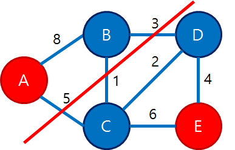
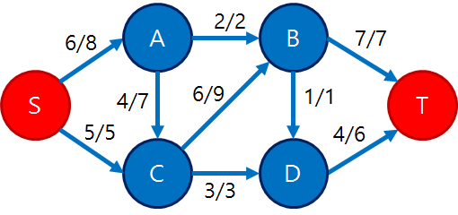

# 최소 컷(Minimum Cut)  
https://blog.naver.com/kks227/220808685331

### 이론

컷(cut)이란 그래프를 양분한다.  

시작은 가중치없는 무향그래프에서 시작해보자   
  

이런 무향 그래프가 있을때 정점 A와 E를 분리하려한다.  

  

그래프를 분리시키는 방법은 이러하다.  
간선을 몇 개 골라서 끊는다. 끊었을 때 그래프가 두 개의 컴포넌트로 분리되면 성공이다.  
예를 들어, 간선(B,D),(C,D),(C,E) 3개를 끊으면 그래프가 {A,B,C},{D,E} 2개의 컴포넌트로 분리된다.  
이렇게 그래프를 양분 시키는 간선 집합을 끊는 것을 컷이라한다. 이 때 컷을 간단히 그 간선집합으로 나타내기도 한다.   

컷에는 비용이있다. 이렇게 가중치가 없는 그래프에서는 간선 갯수가 비용과 같다.  
지금 컷의 비용이 3이ㅏㄷ.  

  

이렇게 간선 (A,C), (A,B) 2개를 끊어도 컷이 성립한다.   

이 때의 비용은 2로 아까보다 작다.  그리고 2보다 적은 비용의 컷은 없다.   
이렇게 임의의 두 정점을 정하고, 두 정점을 다른 컴포넌트로 분리시키는 최소비용의 컷을 최소컷(minimum cut)이라고 말한다.  

  

가중치가 있는 그래프라면, 간선을 자르는 비용은 그 가선의 가중치가 된다.  

  

위 그래프에서는 이렇게 간선(A,C), (B,C),(B,D)를 끊는 것이 비용 9로 최소 컷이다.  

  

방향 그래프의 경우에는, A에서 E로 가는 경로만 없도록 끊으면 된다. 따라서 위 그림은 간선(E,C)가 있지만 그걸 끊지 않아도 컷이다.   

최소 컷 개념이 등장한 이유는 플로우와 관련이 있기 때문이다.  

정점 S와 T가 있을 때, S와 T를 분리시키는 최소 컷의 비용은 소스가 S, 싱크가 T이고 각 간선의 비용을 용량이라 할 때 최대유량과 동치다.   
이 내용을 말하는 것이 최대 유량 최소 컷 정리(max-flow min-cut theorem)이다.  

  

이런 방향그래프가 있다고할 때, 최소 컷은 (C,D),(B,D),(B,T)로 총 11이다.  

  

이를 유량 그래프라고 생각하고 최대 유량을 흘리면 최종적으로 각 간선에 이렇게 유량이 흐르고있다.  
여러가지 상태가 있을 수 있는데, 그 중 하나인 상태다.  
지금 이 그래프에서 어떻게 컷을 골라도 그 컷에 포함된 간선들에서 흐르고 있는 유량의 합은 항상 동치다.   
예를 들어 컷(A,B),(C,B),(C,D)는 2+6=3 = 11, 컷(S,A),(S,C)도 6+5= 11.. 어떻게 컷을 골라도 11이다.   
이는 어찌보면 당연하다.  S가 포함된 정점 그룹과 T가 포함된 정점 그룹으로 어떻게 파티션분할을 해도, 그 사이에서는 항상 일정한 유량이 흐르고 있을 것이다.  
그리고 이 값은 최대 유량을 흘리고 있을 경우 최소 컷이 된다. 지금도 최소컷이 11이며 최대유량도 11이다. 컷을 다르게 잡음에 따라 그 간선의 용량 합은 다를 수 있는데, 언제나 컷에 흐르는 유량이 같아야 한다면 당연히 가능한 최대 유량은 가능한 최소컷과 동일해야만한다.  

    

아직 유량이 최대로 흐르지 않는(not fully saturated)간선을 통과할 수 있다고 할 때, S에서 시작해서 도달 가능한 정점과 도달 불가능한 정점으로 분리하면 도달 가능한 정점은 {S,A,B,C}이고 도달 불가능한 정점은 {D,T}가 된다.    
전자를 A, 후자를 B라고 하자.    
이걸 구분 짓는 중요한 역할을 하는 포화 간선들이 (B,D),(B,T),(C,D)이고 이들이 최소 컷이다.  
이 컷들이 정점 그룹을 양분하는데 이 것이 S에서 도달 가능한 그룹(A)와 도달 불가능한 그룹(B)임이 관찰 가능하다.   

최소 컷과 최대유량이 불일치한다고 가정해보자.  
그러려면 포드 폴커슨이나 에드몬드카프 알고리즘으로 그래프에 최대한 유량을 흘려보낸 상태에서 다음과 같은 두 가지 경우가 있어야 한다.   

1. A에 속한 정점 u, B에 속한 정점 v에 대해 아직 용량이 다 차지 않은 간선 (u,v)가 있다.   
만약 이런 간선이 있다면 실제로는 이 컷의 비용은 흐르고 있는 유량보다 크다. 따라서 최대 유량과 최소 컷의 값이 달라져야한다.  그러나 이런 경우는 없다.  왜냐면 그럴 경우 A에 속한 u에서 B에 속한 v로 아직 갈 수 있다는 의미고, v는 B가 아니라 A에 속해야한다. 따라서 모순이다.   

2. B에 속한 정점 u, A에 속한 정점 v에 대해 흐르는 유량이 0보다 큰 간선(u,v)가 있다.   

이때는 이 간선이 컷에는 포함되어 있지는 않지만 유량값에는 영향을 주기 때문에, 최대유량과 최소컷의 값이 달라지게 만든다. 최대 유량이 최소 컷보다 작아질 것이다.  
그러나 이 경우 역시 존재할 수 없다. 포드 풀커슨 알고리즘의 특성상 이때는 역방향간선(v,u)로 유량을 보낼 수 있는 상태가 되낟.  
따라서 이 역방향 간선을 통해 u에 도달할 수가 있게 되고, u는 B가 아니라 A에 속해야 한다. 이는 모순이다.   

위 두 경우가 없으므로 A에 속한 정점 u, B에 속한 정점 v쌍에 대해 항상 간선 (u,v)는 꽉 차있고, 간선(v,u)엔 유량이 하나도 흐르지 않아야한다.  
이 때문에 최대유량은 최소컷과 같음이 증명되낟. 최소컷은 이 간선들의 용량 합과 같은데, 이 모든 용량에 유량이 최대로 흐르고 있기 때문에 최대 유량역시 용량합과 같다.  