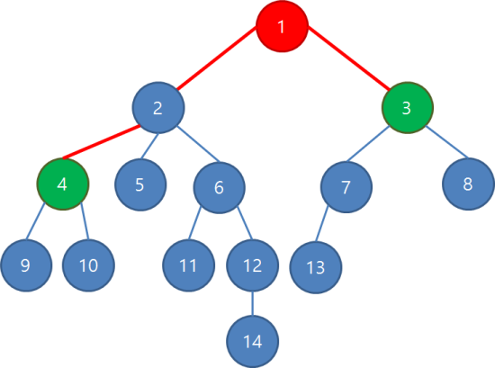
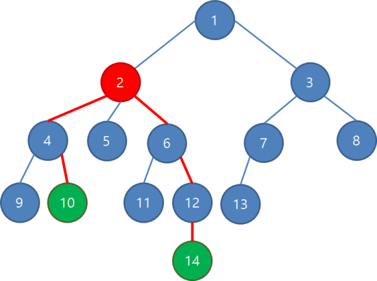
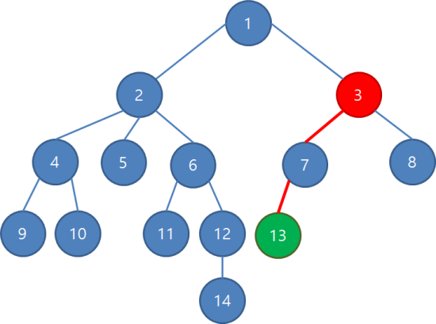

# 최소 공통 조상(Lowest Common Ancestor)

### 이론

LCA란, 트리상에서 어떤 두 정점u,v가 있을 떄, u이거나 u의 조상이면서 동시에 v이거나 v의 조상인 도드들 중 가장 깊은 노드다.  

  

이런 트리가 있을 때, 4번 정점과 3번 정점의 LCA는 1이다.  
이 때 빨간색으로 칠해진 간선들을 이오버면 두 정점 사이의 최단 경로가 된다.  


  

10번 정점과 14번 정점의 LCA는 2번 정점이다.   

  

3번 정점과 13번 정점의 LCA는 3번 정점이다.   
트리에는 싸이클이 없기 때문에, 두 정점 u,v의 LCA를 w라하면 두 정점 사이의 최단경로는 u-w-v의 형태가 된다.   
대부분의 LCA문제에서 이 경로는 중요하다. 트리에서 지나칠정도로 최단경로를 빨리 찾기를 원한다면 먼저 LCA를 생각해봐야한다.   

LCA를 찾는 방법은 여러가지가 있는데, 세그트리를 사용하는 방법은 종만북에 나와 있다.   

여기선 DP방식을 쓰겠다.   
DP를 사용하여 바텀업으로 각 정점의 정보들을 저장해놓는다.   
양쪽 다 크기 N인 트리 O(logN)만에 두 특정 정점의 LCA를 찾을 수 있다.  

LCA를 가장 단순하고 쉽게 찾는 방법은, 그냥 두 정점 중 깊이가 더 깊은 정점에서 계속 부모로 둘의 깊이가 같아질때까지 부모로 이동한다.   
그리고 두 정점이 만날때까지 두 정점을 동시에 부모로 이동시키면, 두 정점이 만나는 지점이 LCA가 된다.   

기본적인 알고리즘은 위와 동일하지만, 부모로 이동시키는 것을 더 빨리, 많이 건너뛰는것이 아이디어다.   


https://www.acmicpc.net/problem/11438

희소테이블을 그대로 도입해서 유용하게 쓸 수 있다.  
방법은, 원래는 자신의 부모 하나만을 parent배열로 저장하던 것을 확장하여 2차원 parent[u][k]로 만든다. 이는 정점u의 2^k번째 부모다.   

  

표로 나타내면 이와 같다.  
그렇다면 이제 이 배열을 사용하여, 정점을 건너뛰는것을 좀 더 빨리 할 수 있다.  
일단, 2^(k+1) = 2^k+ 2^k이므로, parent[u][k+1] = parent[parent[u][k][k]의 식으로 구할 수 있다. 이렇게 k=i일때의 정보가 모두 있다면 k =i+1일때의 정보를 그에 기반하여 얻을 수 있으므로, 바텀업 DP를 사용하여 parent배열을 채울 수 있다.   

이제 이 parent배열을 사용하여 LCA를 빨리 찾아야한다.  
아까 LCA를 찾는 방식을 이렇게 2개의 단계로 나눌 수 있다. 두 정점 u,v가 있고 depth[u] >= depth[v]일 때,

1. depth[u] > depth[v]일 때, u를 parent[u]로 대체하는것을 반복한다.   
2. u!= v일 때, u를 parent[u], v를 parent[v]로 동시에 대체하는 것을 반복한다.   

이제 이 두 과정을 새로운 parent배열로 더 빨리해야한다.   

먼저 1은 이렇게 할 것이다.  

만약 parent[u][k] != parent[v][k]라고 하자. 그럼 일단 두 정점 u,v의 LCA깊이는 둘로부터 2^k보다는 멀리 떨어져 있음이 확실하다.  
그런데 이 상태에서 parent[u][k+1] == parent[v][k+1]이면, 2^k, 2^(k+1) 사이의 어딘가 둘의 LCA가 있다는 뜻이다.    
이제 k를 큰 값부터 시도하면서 순회하여, parent[u][k] != parent[v][k]이면 u,v를 동시에 2^k만큼 위로 올려보내면 된다.    


```cpp

#include <cstdio>
#include <cstring>
#include <vector>
#include <algorithm>
using namespace std;
const int MAX = 18; // roundup log(2,100000)

int N,M;
int parent[100000][MAX]; // parent[i][k]: i의 2^k번째 부모
int depth[100000]; // 정점의 깊이(루트의 깊이:0)
vector<int> adj[100000]; // 인접 리스트

// dfs로 트리 제작하며 parent[i][0], depth 배열을 채움

void makeTreeByDFS(int curr){
    for(int next : adj[curr]){
        if(depth[next] == -1){
            parent[next][0] = curr;
            depth[next] = depth[curr] +1;
            makeTreeByDFS(next);
        }
    }
}

int main(){
    scanf("%d", &N);
    for(int i=0; i < N-1; i++){
        int u,v; 
        scanf("%d %d",&u,&v);
        u--;v--;
        adj[u].push_back(v);
        adj[v].push_back(u);
    }
    //배열 초기화
    memset(parent,-1,sizeof(parent));
    fill(depth,depth+N,-1);
    depth[0] = 0;
    //트리만들기
    makeTreeByDFS(0);

    //parent 배열 채움
    for(int j=0; j < MAX-1; j++)
        for(int i=1; i< N; i++)
            if(parent[i][j] != -1)
                parent[i][j+1] = parent[parent[i][j]][j];
    
    //쿼리 입력받기
    scanf("%d",&M);
    for(int i=0; i < M; i++){
        int u,v;
        scanf("%d %d", &u, &v);
        u--;v--;

        // depth[u] >= depth[v]가 되도록 필요에 따라 u,v를 스왑
        if(depth[u] < depth[v]) swap(u,v);
        int diff =depth[u] - depth[v];

        // 깊이 차 (diff)를 없애며 u를 이동시킴

        for(int j=0; diff; j++){
            if(diff%2) u= parent[u][j];
            diff/=2;
        }

        // u와 v가 다르면 동시에 일정 높이만큼 위로 이동시킴

        if(u != v){
            //높이 2^17, 2^16, ... 1 순으로 시도
            for(int j= MAX-1; j >= 0; j--){
                if(parent[u][j] != -1 && parent[u][j] != parent[v][j]){
                    u = parent[u][j];
                    v = parent[v][j];
                }
            }
            // 마지막엔 두 정점 u,v의 부모가 같으므로 한 번 더 올림
            u = parent[u][0];
        }
        printf("%d\n", u+1);
    }
}
```
소스코드다. 입력을 받아서 트리를 형성하는 부분도 있다. 보통 트리관련 문제는 전처리가 들어간다.   
희소테이블 글에서 설명한 문제와 다르게, 다음이동이라는게 없을 수도 있다. 즉, 조상이 없는 경우다. 이 코드에서는 "-1"갑승로 초기화해두고 사용하고있다.   

그럼 LCA는 언제 유용할까?  
가장 유명한 예시는 트리상에서 두 정점의 거리를 빠르게 구하는 것이다.    

https://www.acmicpc.net/problem/1761   

그래프가 아니라 트리이기 때문에 이 문제를 푸는게 가능하다.   
두 정점 u,v가 주어지고 이 두정점 사이의 거리를 구하려면, 애초에 트리에서는 두 정점 사이의 경로가 하나기때문에 최단이라는 개념이 없다. 그냥 거리만 구하면 최단거리다.   
이 떄 이 경로는 LCA를 w라하면 u-w-v의 형태가 된다.   
즉, 거리는 (u와 w사이의 거리)+ (v와 w사이의 거리)가 된다. LCA를 구하면 해결된다.   
이 때, 모든 정점 사이의 거리를 바로 알기는 힘들지만, 어떤 루트 r이 있다고 하면 u와 w사이의 거리는 (u와 r사이의 거리)-(w와 r사이의 거리)가 되므로, 루트를 아무거나 정하고 모든 정점에 대해 자신과 루트 사이의 거리를 구하면 된다.   


```