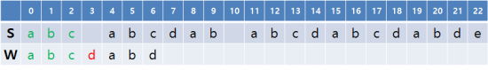
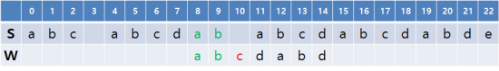

# KMP 알고리즘(Knuth–Morris–Pratt Algorithm)


### 이론

안녕하세오.  
문자열을 해봐오.  
문자열로 검색을 할것이에오.  
"I have a pen. I have an apple."에서 "have"를 찾아봐오.   
눈으로 보면 바로 보이지만, 컴퓨터로 그 시작위치를 찾는다면 

```cpp

#include <iostream>
#include <string>
using namespace std;
 
int main(){
    string S = "I have a pen. I have an apple.";
    string W = "have";
    cout << "sentence: " << S << endl;
    cout << "word: " << W << endl;
    for(int i=0; i<S.size()-W.size(); i++){
        bool found = true;
        for(int j=0; j<W.size(); j++){
            if(S[i+j] != W[j]){
                found = false;
                break;
            }
        }
        if(found) cout << "position: " << i << " ~ " << i+W.size() << endl;
    }
}
[출처] KMP 알고리즘(Knuth–Morris–Pratt Algorithm) (수정: 2019-09-01)|작성자 라이

```

이렇게 2중 for문으로 구현할 수 있어오.   
아주 단순해오.  
S의 가능한 모든 위치를 W의 사작점과 매칭시키고 한 글자씩 맞는지 비교하다가 다른 지점이 나오면 탈풀해오.   
이 때의 시간복잡도는 S의 길이를 N, W의 길이를 M이라 하면 O(N,M)이 되오.   

하지만 KMP는 갓이에오.   
어떤 경우에도 O(N+M)에 찾는데오.   

https://www.acmicpc.net/problem/1786

이 문제를 보면, 단순히 첫 째 줄에서 둘 째줄을 찾기만 하면 되는데, 각 길이가 최대 백만이다.  
어쩌지?  
그리고 현실적으로 O(N+M)의 시간복잡도보다 줄이는건 불가능함.   
S의 모든글자와 W의 모든글자를 한번 씩 보기만해도 O(N+M)이기 때문.   
일단은 이 문제에서 KMP의 아이디어가 뭔지 많은 힌트를 주고있음.   

최악의 케이스를 봐보자.   
"aaaaaaaaaaaaaa"와 "aaaab"   
S와 W에 a가 계속 반복되므로 S의 매 위치마다 최소 5번의 비교가 이루어짐.   
W가 "BaBaB"같아서 바로바로 앞에서 틀리면 최소한 비교는 적게할텐데.   
W에 반복되는 부분이 굉장히 많다. 일단 그런 느낌이 온다 .  

S = "abc abcdab abcdabcdabde", W = "abcdabd" 라고 해보자.   
공백도 엄연한 문자로 친다.   
S에서 몇번째 글자를(0부터 시작) 시작점으로 놓고 W와 비교하고 있는지를 i라 두자.   
W의 몇번째 글자를 (0부터 시작) 비교하고 있는지를 j라하자.   

   

일단 i=j=0인 상태에서 비교를 하다 보면 처음 세 글자는 같다가 네 번째 글자(j=3)부터 다르게 된다.  

   
  아무 상관이 없다고 한다.  
왜? W의 구조를 보면, 처음 세글자에 반복되는 글자가 하나도 없다.그런데 i=0일 때 S,W의 처음 세글자가 일치했다는건, i=1, i=2일땐 첫글자부터 절대 일치할 수 없다는 소리다. W의 첫 세글자가 다 다르기 때문.   
i=4로 넘어가보자.  

   

이번엔 놀랍게도 W의 첫 여섯글자가 맞다가, j=6일때 어긋난다.  

   

이번엔 6칸을 건너뛰면 될까? 안된다. 만약 S = 'abcdabcdabd'면, i=0,j=6일 때 어긋낫다고 i=6로 건너뛰면 찾을수가 없게된다.   
왜 아까는 되고 지금은 안될까?  아까는 글자들이 다 달라서 괜찮았지만 이번엔 W의 구조에 반복되는 문자열이 있다. W의 처음 여섯글자 'abcdab'를 보면 아까와 달리 'ab'가 시작과 끝에서 반복된다.   

   

KMP는 이번엔 섣불리 6칸을 건너뛰지말고 4칸만 건너뛰어서 i=8로 가야한다고 한다. W의 처음 여섯글자에서 'ab'가 앞뒤로 반복된다. 그리고 방금 전의 W의 첫 여섯글자가 일치했고, S의 4칸을 건너뛰었으니 저 반복구조에 의해 W의 첫 두글자'ab'는 이미 일치한다. 따라서 j=0~1인 구간을 건너뛰고 j-2일 때부터 비교해도 된다.    

   

j=2가 되어 어긋나고, u를 증가시켜야하는데   
W의 듀 글자"a,b"에 반복되는 글자가 없기 때문에 i를 2칸 건너뛰어도 된다.   

   

그 다음, i=11이 되었을때 역시 j=6일 때 어긋나게 되는데  
아까와 똑같이 i=15, j=2인 지점부터 다시 비교하면  

   

이렇게 S에서 W를 찾을 수 잇다. i=17로 건너뛰었으면 저걸 찾을 수 없었다.    

좀 더 체계적으로 설명해보겠다.   

KMP에서는 W의 각 위치마다 별도의 실패함수(failure function)값이 존재한다.   
이 값은 불일치가 발생했을 때 j가 어디로 이동해야하는지를 나타내느 ㄱ밧이다.   
아까 j=0부터가 아니라 조금 더 큰 값에서 시작할 때가 있었는데, j=6에서 틀렸을때 j=0이 아닌 j=2로 간 적이있었다. 이는 fail(6)=2이기 때문이다. 그럼 실패함수는 어떻게 결정될까?  

fail(x) = W의 처음(x+1)글자 중, 일치하는 접두사/ 접미사 중 최대 길이(이 때, 문자열 전체의 경우는 제외함).  

   

표로 보자.  
일치하는 접두사/접미사라는 건, 길이가 L인 접두사와 접비사가 같은 경우다.   
이걸 만족하는 L들 중 최댓값이 fail(x)가 되고, 만약 아예 그런 L이 없으면 fail(x)=0.

   

또 다른 예, W = "abacabad"일 경우다.  
그리고 W = "abacabad"일 경우엔, fail(x)가 M의 절반을 넘기는 경우가 존재한다. x=8일 때 "abaaba"가 된다. 이 경우는 조금 있다가 살펴보자.   

이 표가 지그까지 KMP의 설명을 축약하고 총괄해서 말해주고 있다.  

   

특정 i,j에서 불일치가 발생했다고 할 때, fail(j)가 0보다 크다고 하자. i는 S, j는 W기준의 위치임을 상기하자. 이 때 W의 길이 j인 접두사를 W'라 할때, W'의 길이 fail(j)인 접두사와 접미사가 같다. 각각그림에서 초록색으로 표시된 부분이다.  

또한 지금 S에서 노란색 부분의 끝에서 fail(j)글자 또한 초록색 부분과 일치한다. 지금은 W'의 접미사와 일치하지만, 그 말은 즉 접두사와도 일치한다는 것이다.  
따라서 W의 위치를 저렇게 옮겨서 접두사 부분을 원래 접미사가 있던 위치로 일치시켜도, 저 fail(j)칸 만큼은 아직 S와 일치하기 때문에 그 다음 글자부터 비교하면 된다.   
그 다음 글자는 W의 시작으로부터 fail(j)번째 글자다. 즉, j=fail(j)가 되는것이고 이는 불일치가 곧 실패라 보면 실패함수가 하는 일의 의미를 얼추 갖추게 되었다고 새악ㄱ할 수 있다.   

그리고 i는 그대로 있거나 증가하기만하고, j만 바뀌며 그에 맞춰 W가 움직인다고 생각하는것이 편한다. W에서 j보다 이전에 있는 글자들은 이미 일치한다고 판명된 것이다.   

    

여기서 하나를 짚고 넘어가자, 저렇게 큼직하게 넘어가도 될까?  
만약 fail(j)만큼 건너뛰어 버렸더니 S와 그 사이 지점에 W가 있던 걸 놓쳐버리지는 않을까? 그럴 수 없다. 현재 S의 위치가 i,놓쳐버린 W의 위치가 s에서 i'이라고 하자. 이 때 i< i' < i+j-fail(j)여야 얘기가 될 것이다.   

여기서 S[i':i+j]부분을 보자. 이 부분의 길이를 L, W의 길이 j인 접두사를 W'이라고 할때, S의 그 부분은 W'의 길이 L인 접미사 부분과 일치한다. W에서 j전에 있는 문자들은 다 현재 S와 일치하고 있기 때문이다.  

그런데 저 부분은 W'(또는 W)의 길이 L인 접두사이기도 하다. 이렇게 되면 W'의 길이 L인 접두사와 접미사가 같다는 것이다.   
따라서 fail(j)는 최소한 L은 되어야한다. 저렇게 작으면 모순이 된다.   


```cpp

#include <cstdio>
#include <cstring>
#include <vector>
using namespace std;
const int MAX = 1000000;
 
int main(){
    char W[MAX+1], S[MAX+1];
    int M, N;
    gets(S);
    gets(W);
    N = strlen(S);
    M = strlen(W);
 
    int fail[MAX] = {...};
 
    // S, W의 일치하는 지점을 result에 모음
    vector<int> result;
    for(int i=0, j=0; i<N; i++){
        // 현재 글자가 불일치하면 fail 값을 계속 따라감
        while(j > 0 && S[i] != W[j]) j = fail[j-1];
        // 현재 글자가 일치
        if(S[i] == W[j]){
            // W를 S[i:i+M-1]에서 찾음
            if(j == M-1){
                // i=0부터 시작한다면 i-M+1. 문제 조건에 따라 1을 더함
                result.push_back(i-M+2);
                // 찾지 못한 것처럼 j를 이동시키면 됨
                j = fail[j];
            }
            else j++;
        }
    }
 
    // 결과 출력
    printf("%d\n", result.size());
    for(int i: result)
        printf("%d ", i);
}
[출처] KMP 알고리즘(Knuth–Morris–Pratt Algorithm) (수정: 2019-09-01)|작성자 라이


```

실패 함수 값을 모두 안다고 할 때, KMP소스 코드중 하나는 위와 같다. 실패함수 값은 배열 fail[]로 주어져 있다. 전체적인 구조는 지금까지 설명한 것과 같고, 세세한걸 더 살펴보자.  

일단 